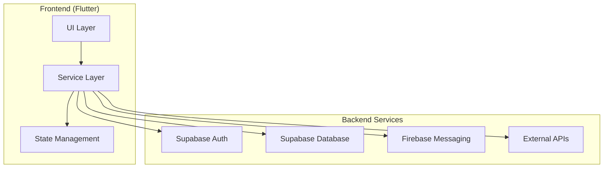
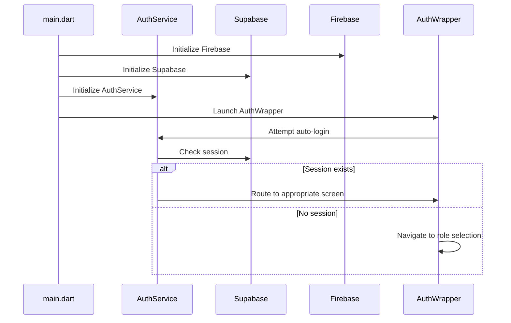
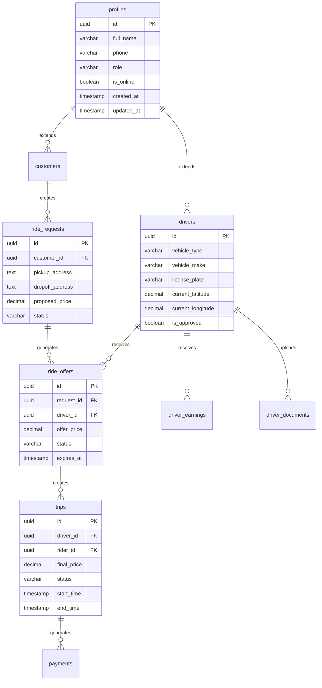
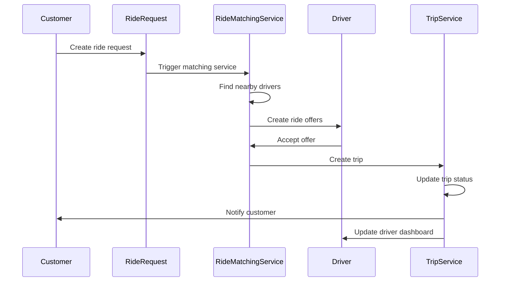
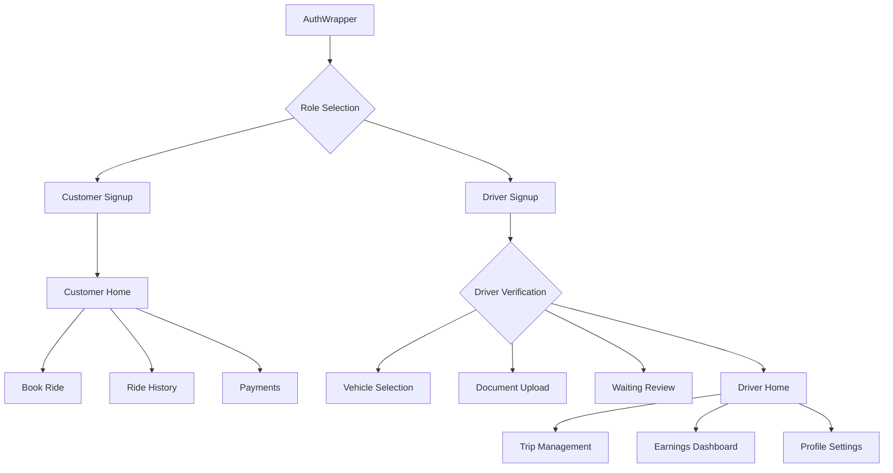

# AlboCarRide Architecture Overview

## Executive Summary

AlboCarRide is a comprehensive ride-hailing application built with Flutter, featuring a modern architecture that supports both customer and driver workflows. The application leverages Supabase for backend services, Firebase for push notifications, and follows a clean, service-oriented architecture.

## System Architecture

### High-Level Architecture Diagram



### Technology Stack

| Component | Technology | Purpose |
|-----------|------------|---------|
| **Frontend** | Flutter 3.9+ | Cross-platform mobile app |
| **Backend** | Supabase | Authentication & Database |
| **Push Notifications** | Firebase Cloud Messaging | Real-time notifications |
| **State Management** | Provider | Local state management |
| **Storage** | Flutter Secure Storage | Session persistence |
| **Location** | Geolocator | GPS tracking |
| **Payments** | Stripe (Planned) | Payment processing |

## Application Architecture

### 1. Application Initialization Flow



### 2. Authentication & Session Management

**Key Components:**
- [`AuthService`](lib/services/auth_service.dart) - Singleton service for auth operations
- [`AuthWrapper`](lib/screens/auth/auth_wrapper.dart) - Authentication routing logic
- [`SessionGuard`](lib/widgets/session_guard.dart) - Route protection

**Features:**
- WhatsApp-style auto-login
- Phone-based OTP authentication
- Secure session storage using FlutterSecureStorage
- Role-based routing (Customer/Driver)

### 3. Service Layer Architecture

#### Core Services

| Service | Purpose | Key Methods |
|---------|---------|-------------|
| [`AuthService`](lib/services/auth_service.dart) | Authentication & session management | `signUpWithPhone()`, `verifyOtp()`, `createDriverProfile()` |
| [`TripService`](lib/services/trip_service.dart) | Trip lifecycle management | `startTrip()`, `completeTrip()`, `getActiveTrip()` |
| [`RideMatchingService`](lib/services/ride_matching_service.dart) | Real-time ride matching | `startMatchingService()`, `acceptOffer()` |
| [`DBService`](lib/services/db_service.dart) | Database operations wrapper | `rpc()` |
| [`LocationService`](lib/services/location_service.dart) | GPS and geocoding | `geocodeAddress()` |
| [`WalletService`](lib/services/wallet_service.dart) | Driver earnings management | `getBalance()`, `updateBalance()` |

### 4. Database Schema

#### Core Tables



### 5. Ride Matching & Trip Management Workflow



#### Trip Lifecycle States:
1. **Pending** - Ride request created
2. **Driver Assigned** - Offer accepted
3. **In Progress** - Trip started
4. **Completed** - Trip finished
5. **Cancelled** - Trip cancelled

### 6. UI Layer Structure

#### Navigation Flow



#### Screen Categories

**Authentication Screens:**
- [`AuthWrapper`](lib/screens/auth/auth_wrapper.dart) - Main authentication router
- [`RoleSelectionPage`](lib/screens/auth/role_selection_page.dart) - User role selection
- [`SignupPage`](lib/screens/auth/signup_page.dart) - User registration
- [`VehicleTypeSelectionPage`](lib/screens/auth/vehicle_type_selection_page.dart) - Driver vehicle setup

**Customer Screens:**
- [`CustomerHomePage`](lib/screens/home/customer_home_page.dart) - Main customer interface
- [`BookRidePage`](lib/screens/home/book_ride_page.dart) - Ride booking
- [`RideHistoryPage`](lib/screens/home/ride_history_page.dart) - Trip history
- [`PaymentsPage`](lib/screens/home/payments_page.dart) - Payment management

**Driver Screens:**
- [`EnhancedDriverHomePage`](lib/screens/home/enhanced_driver_home_page.dart) - Driver dashboard
- [`DriverTripManagementPage`](lib/screens/home/driver_trip_management_page.dart) - Active trip management
- [`VerificationPage`](lib/screens/driver/verification_page.dart) - Document verification
- [`WaitingForReviewPage`](lib/screens/driver/waiting_for_review_page.dart) - Approval waiting screen

### 7. Key Features & Capabilities

#### Authentication & Security
- Phone-based OTP verification
- Secure session management
- Role-based access control
- Automatic session restoration

#### Ride Management
- Real-time ride request matching
- Location-based driver discovery
- Trip lifecycle management
- Real-time trip tracking

#### Driver Management
- Document verification workflow
- Vehicle registration
- Approval process
- Earnings tracking

#### Customer Experience
- Ride booking interface
- Trip history
- Payment management
- Real-time notifications

### 8. External Integrations

**Current Integrations:**
- **Supabase** - Backend-as-a-Service (Auth + Database)
- **Firebase Cloud Messaging** - Push notifications
- **Geolocator** - Location services

**Planned Integrations:**
- **Stripe** - Payment processing
- **Google Maps/Mapbox** - Maps and routing
- **Twilio** - SMS communications

### 9. Development & Deployment

#### Project Structure
```
lib/
├── main.dart                 # Application entry point
├── config/
│   └── api_config.dart      # API configuration
├── models/                  # Data models
├── screens/                 # UI screens
│   ├── auth/               # Authentication screens
│   ├── home/               # Main app screens
│   └── driver/             # Driver-specific screens
├── services/               # Business logic services
├── utils/                  # Utility classes
└── widgets/               # Reusable UI components
```

#### Dependencies
- **Core**: Flutter, Material Design
- **Backend**: Supabase, Firebase
- **Storage**: Secure Storage, Shared Preferences
- **Location**: Geolocator
- **State**: Provider
- **Utilities**: HTTP, UUID, Image Picker

## Architecture Principles

1. **Separation of Concerns** - Clear separation between UI, business logic, and data layers
2. **Singleton Services** - Centralized service instances for state management
3. **Real-time Updates** - Supabase real-time subscriptions for live data
4. **Secure Authentication** - Phone-based OTP with secure session storage
5. **Scalable Design** - Modular architecture supporting feature expansion
6. **Cross-platform** - Flutter-based for iOS and Android compatibility

## Future Enhancements

1. **Payment Integration** - Complete Stripe payment processing
2. **Advanced Analytics** - Driver performance and business insights
3. **Multi-language Support** - Internationalization
4. **Advanced Matching** - AI-powered ride matching algorithms
5. **Fleet Management** - Support for multiple vehicles per driver

This architecture provides a solid foundation for a scalable, maintainable ride-hailing application with clear separation of concerns and robust security measures.