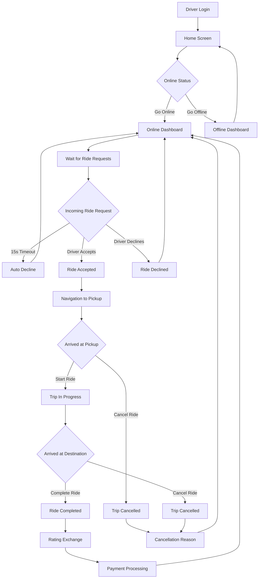

# Driver Workflow Implementation Summary

## Complete Driver Journey Flowchart



## Implementation Priority Matrix

### Phase 1: Core Ride Experience (High Impact, High Urgency)

| Feature | Priority | Estimated Effort | Dependencies |
|---------|----------|------------------|--------------|
| **Enhanced Ride Matching** | P0 | 3 days | Existing RideMatchingService |
| **Ride Request Modal** | P0 | 4 days | EnhancedRideMatchingService |
| **Map Integration** | P0 | 5 days | Google Maps API, Location Service |
| **Push Notifications** | P0 | 3 days | Firebase Cloud Messaging |

### Phase 2: Driver Tools (Medium Impact, Medium Urgency)

| Feature | Priority | Estimated Effort | Dependencies |
|---------|----------|------------------|--------------|
| **Dynamic Pricing** | P1 | 4 days | Ride pricing algorithms |
| **In-App Navigation** | P1 | 5 days | Map integration, Route planning |
| **Performance Analytics** | P1 | 4 days | Database queries, Charts |
| **Document Verification** | P1 | 3 days | File upload, Admin review |

### Phase 3: Enhanced Features (Low Impact, Low Urgency)

| Feature | Priority | Estimated Effort | Dependencies |
|---------|----------|------------------|--------------|
| **Driver Incentives** | P2 | 5 days | Promotional system |
| **Support Chat** | P2 | 4 days | Real-time messaging |
| **Scheduled Rides** | P2 | 6 days | Calendar integration |
| **Multi-stop Trips** | P2 | 7 days | Complex routing |

## Technical Architecture Enhancements

### Database Schema Updates Required

```sql
-- Add surge pricing columns
ALTER TABLE rides ADD COLUMN surge_multiplier DECIMAL(4,2) DEFAULT 1.0;
ALTER TABLE rides ADD COLUMN base_surge_price DECIMAL(10,2);

-- Add driver performance metrics
ALTER TABLE drivers ADD COLUMN acceptance_rate DECIMAL(5,2) DEFAULT 100.0;
ALTER TABLE drivers ADD COLUMN avg_response_time DECIMAL(8,2) DEFAULT 15.0;
ALTER TABLE drivers ADD COLUMN cancellation_rate DECIMAL(5,2) DEFAULT 0.0;

-- Add ride request preferences
ALTER TABLE ride_requests ADD COLUMN vehicle_preference VARCHAR(20);
ALTER TABLE ride_requests ADD COLUMN max_wait_time INTEGER DEFAULT 300;

-- Create driver incentives table
CREATE TABLE driver_incentives (
    id UUID PRIMARY KEY DEFAULT gen_random_uuid(),
    driver_id UUID REFERENCES drivers(id),
    incentive_type VARCHAR(50) NOT NULL,
    description TEXT NOT NULL,
    target_value DECIMAL(10,2),
    current_value DECIMAL(10,2) DEFAULT 0.0,
    reward_value DECIMAL(10,2) NOT NULL,
    status VARCHAR(20) DEFAULT 'active',
    created_at TIMESTAMP WITH TIME ZONE DEFAULT NOW(),
    expires_at TIMESTAMP WITH TIME ZONE
);
```

### New Services Required

#### **DynamicPricingService**
```dart
class DynamicPricingService {
  Future<double> calculateSurgeMultiplier({
    required double latitude,
    required double longitude,
    required DateTime time,
  }) async {
    // Implement demand-based pricing algorithm
    // Consider: time of day, day of week, special events, weather
    // Historical ride density in area
    // Current number of available drivers
  }
  
  Future<Map<String, dynamic>> calculateFare({
    required double distance,
    required int duration,
    required double baseRate,
    double surgeMultiplier = 1.0,
  }) async {
    // Calculate detailed fare breakdown
    return {
      'base_fare': baseRate,
      'distance_fare': distance * ratePerKm,
      'time_fare': duration * ratePerMinute,
      'surge_multiplier': surgeMultiplier,
      'total_fare': total,
    };
  }
}
```

#### **DriverAnalyticsService**
```dart
class DriverAnalyticsService {
  Future<Map<String, dynamic>> getPerformanceMetrics(String driverId) async {
    // Calculate comprehensive performance metrics
    return {
      'acceptance_rate': await _calculateAcceptanceRate(driverId),
      'cancellation_rate': await _calculateCancellationRate(driverId),
      'avg_rating': await _calculateAverageRating(driverId),
      'earnings_trend': await _getEarningsTrend(driverId),
      'peak_hours': await _identifyPeakHours(driverId),
    };
  }
  
  Future<List<Map<String, dynamic>>> getEarningsBreakdown(
    String driverId, {
    required DateTime startDate,
    required DateTime endDate,
  }) async {
    // Generate detailed earnings report by day/week/month
  }
}
```

## User Experience Specifications

### Animation Specifications

#### **Ride Request Modal Animation**
```dart
// Entry animation
AnimationController(
  duration: Duration(milliseconds: 400),
  vsync: this,
)

CurvedAnimation(
  parent: controller,
  curve: Curves.elasticOut, // Bouncy entrance
)

// Countdown animation
CircularProgressIndicator(
  value: countdown / 15.0,
  strokeWidth: 4,
  backgroundColor: Colors.grey[300],
  valueColor: AlwaysStoppedAnimation<Color>(Colors.red),
)
```

#### **Button Interaction States**
```dart
// Accept button states
MaterialStateProperty.resolveWith<Color>((Set<MaterialState> states) {
  if (states.contains(MaterialState.pressed)) {
    return Color(0xFF00B248); // Darker green when pressed
  }
  if (states.contains(MaterialState.hovered)) {
    return Color(0xFF00D95A); // Lighter green when hovered
  }
  return Color(0xFF00C853); // Default green
}),
```

### Error Handling Specifications

#### **Network Error States**
```dart
class NetworkErrorWidget extends StatelessWidget {
  final VoidCallback onRetry;
  final String message;
  
  const NetworkErrorWidget({
    required this.onRetry,
    required this.message,
  });
  
  @override
  Widget build(BuildContext context) {
    return Container(
      padding: EdgeInsets.all(24),
      child: Column(
        mainAxisAlignment: MainAxisAlignment.center,
        children: [
          Icon(Icons.wifi_off_rounded, size: 64, color: Colors.grey[400]),
          SizedBox(height: 16),
          Text(
            'Connection Lost',
            style: TextStyle(
              fontSize: 18,
              fontWeight: FontWeight.w600,
              color: Colors.black87,
            ),
          ),
          SizedBox(height: 8),
          Text(
            message,
            style: TextStyle(
              fontSize: 14,
              color: Colors.grey[600],
            ),
            textAlign: TextAlign.center,
          ),
          SizedBox(height: 24),
          ElevatedButton.icon(
            onPressed: onRetry,
            icon: Icon(Icons.refresh_rounded),
            label: Text('Retry Connection'),
          ),
        ],
      ),
    );
  }
}
```

#### **Offline Capabilities**
```dart
class OfflineService {
  final HiveInterface _hive = Hive;
  
  Future<void> cacheDriverData(String driverId) async {
    // Cache essential driver data for offline use
    final dashboardData = await TripService().fetchDriverDashboard(driverId);
    await _hive.box('driver_cache').put('dashboard_$driverId', dashboardData);
    
    final tripHistory = await TripService().getTripHistory(driverId);
    await _hive.box('driver_cache').put('history_$driverId', tripHistory);
  }
  
  Future<void> syncPendingActions() async {
    // Sync any actions taken while offline
    final pendingBox = _hive.box('pending_actions');
    final pendingActions = pendingBox.values.toList();
    
    for (final action in pendingActions) {
      try {
        await _processPendingAction(action);
        await pendingBox.delete(action['id']);
      } catch (e) {
        // Retry later
      }
    }
  }
}
```

## Testing Strategy

### Unit Tests Required
```dart
// Ride matching algorithm tests
test('Should prioritize closer drivers', () async {
  final service = EnhancedRideMatchingService();
  final drivers = await service.findEligibleDrivers(
    pickupLat: -26.2041,
    pickupLng: 28.0473,
  );
  
  expect(drivers.first['distance'], lessThan(drivers.last['distance']));
});

// Dynamic pricing tests
test('Should apply surge pricing during peak hours', () async {
  final service = DynamicPricingService();
  final multiplier = await service.calculateSurgeMultiplier(
    latitude: -26.2041,
    longitude: 28.0473,
    time: DateTime(2024, 1, 1, 18, 0), // 6 PM - peak hour
  );
  
  expect(multiplier, greaterThan(1.0));
});
```

### Integration Tests
```dart
// Complete ride flow test
testWidgets('Complete ride journey', (WidgetTester tester) async {
  // 1. Driver goes online
  await tester.tap(find.text('GO ONLINE'));
  await tester.pumpAndSettle();
  
  // 2. Receive ride request
  await simulateRideRequest();
  await tester.pumpAndSettle();
  
  // 3. Accept ride
  await tester.tap(find.text('ACCEPT'));
  await tester.pumpAndSettle();
  
  // 4. Complete navigation and ride
  await tester.tap(find.text('START RIDE'));
  await tester.pumpAndSettle();
  
  await tester.tap(find.text('COMPLETE RIDE'));
  await tester.pumpAndSettle();
  
  // 5. Verify completion
  expect(find.text('Ride Completed'), findsOneWidget);
});
```

## Deployment Checklist

### Pre-Deployment Requirements
- [ ] Database schema updates applied
- [ ] Google Maps API keys configured
- [ ] Firebase Cloud Messaging configured
- [ ] Supabase real-time subscriptions tested
- [ ] All unit tests passing
- [ ] Integration tests completed
- [ ] Performance benchmarks met
- [ ] Error handling tested

### Post-Deployment Monitoring
- [ ] Real-time error tracking enabled
- [ ] Performance metrics collection
- [ ] User session analytics
- [ ] Ride matching efficiency monitoring
- [ ] Push notification delivery rates
- [ ] Driver satisfaction surveys

## Success Metrics and KPIs

### Technical Performance
- **Ride Request Response Time**: < 2 seconds
- **Push Notification Delivery**: > 95% success rate
- **App Crash Rate**: < 0.1%
- **Offline Functionality**: 100% core features available

### Business Metrics
- **Driver Acceptance Rate**: Target > 75%
- **Ride Completion Rate**: Target > 95%
- **Driver Retention**: > 80% weekly active drivers
- **Average Rating**: > 4.5 stars

### User Experience
- **Session Duration**: > 45 minutes average
- **Feature Adoption**: > 60% use of new features
- **Support Tickets**: < 5% of active drivers
- **App Store Rating**: > 4.5 stars

## Conclusion

This comprehensive implementation plan provides a complete roadmap for transforming AlboCarRide's driver experience to compete with industry leaders like inDrive. The phased approach ensures systematic development while maintaining application stability and user satisfaction throughout the transformation process.

The implementation leverages existing infrastructure while introducing sophisticated new features that will significantly enhance driver satisfaction, operational efficiency, and platform competitiveness in the ride-sharing market.