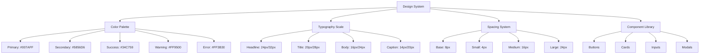
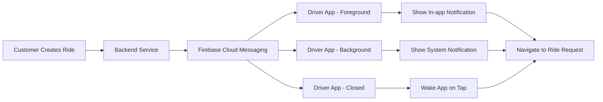
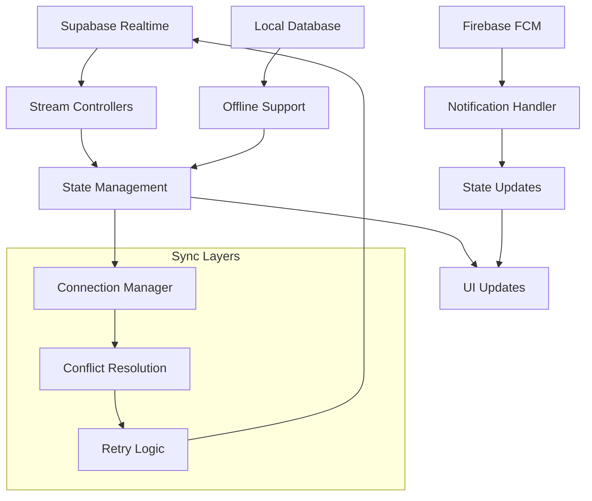

# AlboCarRide Enhancement Plan
## Comprehensive Analysis and Implementation Strategy

**Date:** 2026-01-14  
**Status:** Planning Phase  
**Target:** UI/UX, Real-time Notifications, Map Visualization, Payment Visibility

---

## 1. Current Codebase Analysis

### ✅ **Existing Strengths**
- **Core Functionality**: Complete ride-hailing system with driver/customer roles
- **Database Schema**: Well-structured with RLS policies and atomic operations
- **Real-time Features**: Supabase real-time subscriptions implemented
- **Authentication**: Firebase + Supabase auth with session management
- **Maps Integration**: Google Maps with basic markers and location services
- **Payment Services**: Mobile money integration and wallet system
- **Notification Service**: Basic notification framework with Twilio SMS

### ⚠️ **Identified Gaps & Issues**

#### **UI/UX Issues**
1. **Inconsistent Design Patterns**
   - Mixed color schemes across screens
   - Varying padding/margin values
   - Inconsistent button styles and typography

2. **Layout Problems**
   - Potential overflow issues in driver dashboard
   - Missing loading states in some screens
   - Limited error handling UI

3. **Missing Modern Design Elements**
   - No skeleton loaders
   - Limited animations/transitions
   - Basic card shadows and borders

#### **Notification System Limitations**
1. **Push Notifications Not Implemented**
   - Only simulated push notifications
   - No Firebase Cloud Messaging integration
   - No background/foreground handling

2. **Limited Real-time Updates**
   - Basic Supabase subscriptions but no FCM integration
   - No notification persistence
   - Missing notification center

#### **Map Visualization Gaps**
1. **Basic Marker System**
   - Standard Google Maps markers only
   - No custom car/person icons
   - Limited marker animations

2. **Missing Advanced Features**
   - No route polylines for active rides
   - No driver tracking during trips
   - Basic camera controls only

#### **Payment Visibility Issues**
1. **Limited Payment Information Display**
   - No clear payment method visibility
   - Missing driver payout details
   - Basic transaction history

#### **Code Quality Concerns**
1. **Technical Debt**
   - 612 lint warnings (mostly `avoid_print`, `use_build_context_synchronously`)
   - Mixed architecture patterns
   - Some duplicated logic

---

## 2. UI/UX Improvement Plan

### **2.1 Design System Implementation**


### **2.2 Screen-Specific Improvements**

#### **Customer Home Page (`customer_home_page.dart`)**
- **Issues**: Basic layout, limited visual hierarchy
- **Improvements**:
  - Add hero section with gradient background
  - Implement Uber-style map card with rounded corners
  - Add quick actions with consistent iconography
  - Implement skeleton loaders for map
  - Add empty states for ride history

#### **Driver Dashboard (`enhanced_driver_home_page.dart`)**
- **Issues**: Complex layout, potential overflow
- **Improvements**:
  - Simplify grid layout (2x2 instead of variable)
  - Add online/offline status indicator with animations
  - Implement earnings summary card with charts
  - Add recent rides with swipe actions
  - Implement loading skeletons for all async content

#### **Ride Request Screens**
- **Issues**: Basic forms, limited feedback
- **Improvements**:
  - Add step-by-step ride booking flow
  - Implement address autocomplete with Google Places
  - Add fare estimation with breakdown
  - Implement loading states during search

### **2.3 Component Library Creation**
Create reusable components in `lib/components/`:
- `PrimaryButton`, `SecondaryButton`, `TextButton`
- `Card`, `ElevatedCard`, `OutlinedCard`
- `InputField`, `SearchField`, `DropdownField`
- `LoadingIndicator`, `SkeletonLoader`, `EmptyState`
- `Toast`, `Snackbar`, `Dialog`

---

## 3. Real-time Notification System Architecture

### **3.1 Firebase Cloud Messaging Integration**


### **3.2 Implementation Steps**

#### **Step 1: Firebase Configuration**
1. Add `firebase_messaging` dependency
2. Configure Firebase project for iOS/Android
3. Set up APNs for iOS push notifications
4. Configure Android notification channels

#### **Step 2: Notification Service Enhancement**
```dart
// Enhanced NotificationService with FCM
class EnhancedNotificationService {
  static Future<void> initialize() async {
    // Request permissions
    // Configure foreground/background handlers
    // Set up notification channels
  }
  
  static Future<void> sendRideRequestNotification({
    required String driverId,
    required RideRequest request,
  }) async {
    // Send via FCM with data payload
    // Include deep link to ride request screen
    // Add sound, vibration, priority
  }
  
  static Future<void> sendRideStatusNotification({
    required String userId,
    required RideStatus status,
    required Map<String, dynamic> data,
  }) async {
    // Send status updates
    // Handle different notification types
  }
}
```

#### **Step 3: Notification Handling**
- **Foreground**: Show in-app notification banner
- **Background**: System notification with actions
- **Closed**: Wake app and navigate to relevant screen
- **Notification Center**: Store and display notification history

#### **Step 4: Backend Integration**
- Create Supabase Edge Function for sending FCM messages
- Store notification history in `notifications` table
- Implement read/unread status tracking

---

## 4. Map Visualization Enhancements

### **4.1 Custom Map Markers**
```dart
// Custom marker creation
BitmapDescriptor _createCarIcon(Color color, double bearing) {
  // Create custom bitmap with car icon
  // Rotate based on bearing/direction
  // Add vehicle type indicators
}

BitmapDescriptor _createPersonIcon(Color color) {
  // Create person icon for customers
  // Add status indicators (waiting, in-ride)
}
```

### **4.2 Active Ride Features**
1. **Route Polylines**
   - Draw route between pickup and dropoff
   - Animate polyline drawing
   - Show alternative routes

2. **Driver Tracking**
   - Smooth marker animation during movement
   - Camera follow during active ride
   - ETA updates based on traffic

3. **Pickup/Dropoff Markers**
   - Custom icons for locations
   - Info windows with details
   - Tap actions for navigation

### **4.3 Map Performance Optimizations**
- Marker clustering for dense areas
- Tile caching for offline areas
- Throttled location updates
- Memory management for large maps

---

## 5. Driver Payment Visibility

### **5.1 Payment Information Display**
```dart
// Payment info widget
class PaymentInfoCard extends StatelessWidget {
  final PaymentMethod method;
  final double amount;
  final String driverPayoutMethod;
  
  @override
  Widget build(BuildContext context) {
    return Card(
      child: Padding(
        padding: EdgeInsets.all(16),
        child: Column(
          crossAxisAlignment: CrossAxisAlignment.start,
          children: [
            Text('Payment Details', style: Theme.of(context).textTheme.titleMedium),
            SizedBox(height: 12),
            _buildPaymentMethodRow(),
            SizedBox(height: 8),
            _buildAmountRow(),
            SizedBox(height: 8),
            _buildPayoutMethodRow(),
          ],
        ),
      ),
    );
  }
}
```

### **5.2 Features to Implement**
1. **Ride Confirmation Screen**
   - Clear payment method display (Cash/Card/Wallet)
   - Fare breakdown with taxes/fees
   - Driver payout method (if applicable)

2. **Active Ride Screen**
   - Live fare calculation during trip
   - Payment method reminder
   - Tip addition interface

3. **Payment History**
   - Detailed transaction history
   - Earnings summary by period
   - Payout status tracking

### **5.3 Security Considerations**
- Never display full card numbers
- Mask sensitive payment information
- Secure API calls for payment data
- Session-based authentication

---

## 6. Real-time Data Sync Strategy

### **6.1 State Management Architecture**


### **6.2 Implementation Components**

#### **Connection Manager**
- Monitor network status
- Handle reconnection logic
- Queue offline operations

#### **Conflict Resolution**
- Last-write-wins for simple data
- Manual resolution for critical data
- Version tracking for complex objects

#### **Ride State Synchronization**
```dart
enum RideState {
  requested,
  searching,
  accepted,
  driverArriving,
  tripStarted,
  tripCompleted,
  cancelled,
}

// State sync service
class RideStateSyncService {
  final StreamController<RideState> _stateController;
  final SupabaseClient _supabase;
  
  Stream<RideState> get stateStream => _stateController.stream;
  
  Future<void> syncRideState(String rideId) async {
    // Subscribe to realtime updates
    // Handle state transitions
    // Notify both driver and customer
  }
}
```

---

## 7. Code Quality Improvements

### **7.1 Linting and Formatting**
1. **Fix All Lint Warnings**
   - Replace `print()` with proper logging
   - Fix `use_build_context_synchronously` issues
   - Resolve `unused_*` warnings

2. **Implement Consistent Formatting**
   - `.dart_tool` configuration
   - Pre-commit hooks
   - CI/CD lint checks

### **7.2 Architecture Refactoring**
1. **Separation of Concerns**
   - Move business logic from UI
   - Create service layer for data operations
   - Implement repository pattern

2. **Dependency Injection**
   - Use provider/get_it for service management
   - Mock services for testing
   - Configurable service implementations

### **7.3 Performance Optimizations**
1. **Image/Asset Optimization**
   - Compress images
   - Lazy loading for assets
   - Cache management

2. **Build Size Reduction**
   - Tree shaking
   - Code splitting
   - Asset bundling optimization

---

## 8. Testing and Validation Strategy

### **8.1 Test Coverage Goals**
- **Unit Tests**: 80% coverage for services and models
- **Widget Tests**: Critical UI components
- **Integration Tests**: Core user flows

### **8.2 Test Scenarios**
1. **Notification Flow**
   - Driver receives ride request notification
   - Customer receives driver found notification
   - Background/foreground notification handling

2. **Map Functionality**
   - Marker display and interaction
   - Route calculation and display
   - Real-time location updates

3. **Payment Flow**
   - Payment method display
   - Fare calculation accuracy
   - Transaction history

### **8.3 Performance Testing**
- App launch time (< 2 seconds)
- Map loading performance
- Notification delivery latency
- Battery impact measurement

---

## 9. Implementation Roadmap

### **Phase 1: Foundation (Week 1-2)**
1. **Design System Implementation**
   - Create component library
   - Update color scheme and typography
   - Implement consistent spacing

2. **Code Quality Baseline**
   - Fix critical lint warnings
   - Set up CI/CD pipeline
   - Create testing framework

### **Phase 2: Notifications (Week 3-4)**
1. **Firebase FCM Integration**
   - Configure iOS/Android
   - Implement notification service
   - Test foreground/background handling

2. **Backend Notification System**
   - Create Supabase Edge Functions
   - Implement notification history
   - Add real-time updates

### **Phase 3: Maps & UI (Week 5-6)**
1. **Map Visualization**
   - Custom marker implementation
   - Route polyline drawing
   - Driver tracking features

2. **UI Refactoring**
   - Update customer home screen
   - Enhance driver dashboard
   - Improve ride request flow

### **Phase 4: Payment & Polish (Week 7-8)**
1. **Payment Visibility**
   - Implement payment info cards
   - Add transaction history
   - Enhance security features

2. **Performance & Polish**
   - Optimize app performance
   - Add animations and transitions
   - Final testing and bug fixes

### **Phase 5: Deployment & Monitoring**
1. **App Store Deployment**
   - iOS App Store submission
   - Google Play Store submission
   - Beta testing program

2. **Monitoring & Analytics**
   - Crash reporting setup
   - Usage analytics
   - Performance monitoring

---

## 10. Success Metrics

### **Technical Metrics**
- App crash rate < 0.5%
- Notification delivery rate > 95%
- Map loading time < 3 seconds
- Battery usage increase < 10%

### **User Experience Metrics**
- User rating improvement (target: 4.5+)
- Ride completion rate improvement
- Notification engagement rate
- Customer support ticket reduction

### **Business Metrics**
- Increased driver acceptance rate
- Reduced ride cancellation rate
- Improved customer retention
- Higher transaction volume

---

## 11. Risk Mitigation

### **Technical Risks**
1. **Firebase Integration Complexity**
   - **Mitigation**: Start with basic FCM, expand gradually
   - **Fallback**: Maintain existing SMS notifications

2. **Performance Impact**
   - **Mitigation**: Profile and optimize regularly
   - **Fallback**: Implement feature flags for heavy features

3. **Platform-Specific Issues**
   - **Mitigation**: Test on multiple devices/OS versions
   - **Fallback**: Graceful degradation for unsupported features

### **Project Risks**
1. **Timeline Slippage**
   - **Mitigation**: Agile approach with weekly sprints
   - **Contingency**: Prioritize core features, defer enhancements

2. **Resource Constraints**
   - **Mitigation**: Focus on high-impact features first
   - **Contingency**: Leverage existing libraries and services

---

## 12. Next Steps

### **Immediate Actions (Next 48 Hours)**
1. **Review and Approve Plan**
   - Stakeholder review of this document
   - Priority alignment with business goals
   - Resource allocation confirmation

2. **Setup Development Environment**
   - Create feature branches
   - Set up Firebase project
   - Configure development tools

3. **Begin Phase 1 Implementation**
   - Start with design system components
   - Fix critical lint warnings
   - Set up testing infrastructure

### **Decision Points**
1. **Design System Approval**
   - Color palette and typography
   - Component library specifications
   - Animation and transition guidelines

2. **Notification Strategy**
   - FCM vs alternative providers
   - Notification content templates
   - Privacy and permission handling

3. **Release Strategy**
   - Phased rollout vs big bang
   - Beta testing group selection
   - Rollback procedures

---

**Prepared by:** Roo (Architect Mode)  
**Last Updated:** 2026-01-14  
**Version:** 1.0